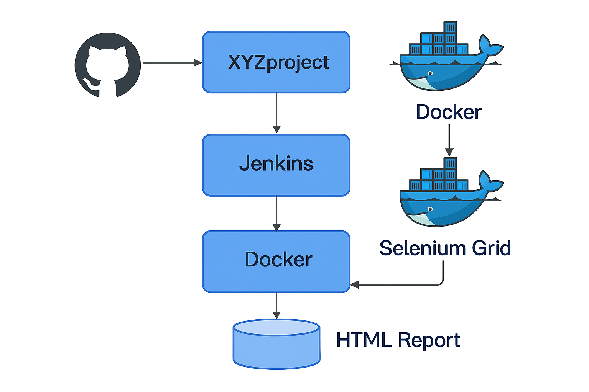

# XYZ Web 自動化測試專案

本專案使用 [Selenium WebDriver](https://www.selenium.dev/)、[pytest](https://docs.pytest.org/) 搭配 Jenkins 與 Selenium Grid 實現完整的 CI/CD 自動化測試流程。

---

## 📦 專案結構概覽

```
XYZproject/
├── page/              # Page Object 模組
├── script/            # 測試案例 (pytest)
├── Dockerfile.runner  # Jenkins CI 執行環境 (marktw75/xyzproject-runner)
├── Jenkinsfile        # Jenkins Pipeline 腳本
├── requirements.txt   # 相依套件清單
├── run-tests.sh       # 測試執行腳本
└── pytest.ini         # pytest 設定
```

---

## 🔧 建置相關服務

本專案依賴兩個外部服務部署於 Jenkins Server：

1. 📌 [selenium-grid-config](https://github.com/MarkTsaiCqi/selenium-grid-config)：用於架設 Selenium Hub + Chrome/Firefox Node
2. 📌 [jenkins-deploy-config](https://github.com/MarkTsaiCqi/jenkins-deploy-config)：自動建構 Jenkins 並預裝 Plugin、準備 CI 執行環境

這兩個服務可於任一 Linux Server 上部署並長時間運行，作為測試後端。

---

## 🔁 CI/CD 架構圖



> Jenkins 是流程的觸發中心，Selenium Grid 是測試執行環境，Docker 則負責提供一致的執行容器。

---

## 🚀 Jenkins CI 執行流程

Jenkins Pipeline 執行步驟如下：

1. ✅ 觸發 Pipeline（手動或 Git push）
2. ✅ 拉取專案原始碼
3. ✅ 使用 `marktw75/xyzproject-runner` Docker image 執行測試
4. ✅ 透過 Selenium Grid 執行自動化測試
5. ✅ 產出 HTML 測試報告並整合 Jenkins UI 顯示

### Jenkinsfile 範例片段：
```groovy
pipeline {
  agent {
    docker {
      image 'marktw75/xyzproject-runner'
    }
  }
  environment {
    SELENIUM_REMOTE_URL = "http://mark-i7:4444/wd/hub"
  }
  stages {
    stage('Run Tests') {
      steps {
        sh './run-tests.sh'
      }
    }
    stage('Publish HTML Report') {
      steps {
        publishHTML(target: [
          reportDir: 'reports',
          reportFiles: 'report.html',
          reportName: 'Selenium Test Report'
        ])
      }
    }
  }
}
```

---

## 📜 測試報告

- 測試報告會儲存在 `reports/report.html`
- Jenkins Pipeline 會自動整合並顯示於每次 Build 的報告頁面中

---

## 🧪 本地測試方式

可於開發機上直接執行測試（需安裝 Python + Selenium）：

```bash
python3 -m venv .env
source .env/bin/activate
pip install -r requirements.txt

SELENIUM_REMOTE_URL=http://localhost:4444/wd/hub pytest script/test_xyz_home.py   --html=reports/report.html   --self-contained-html
```

---

## 🪪 授權

MIT License

[]()
